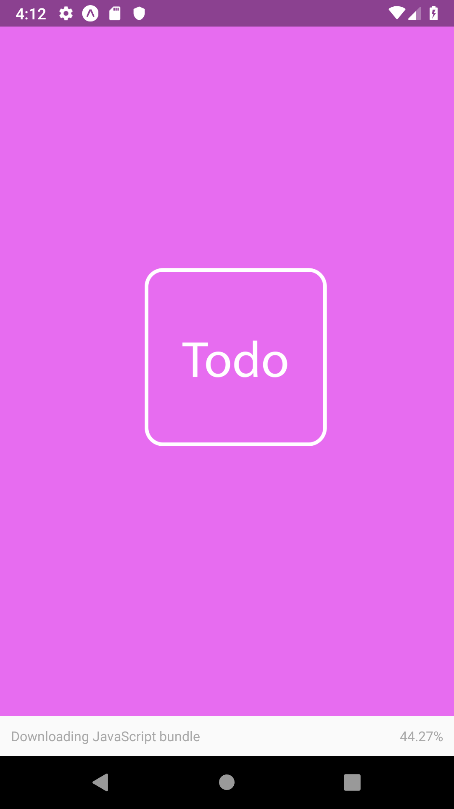
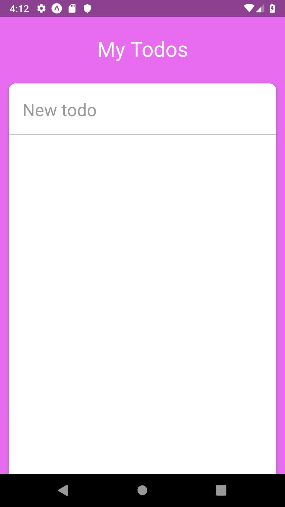
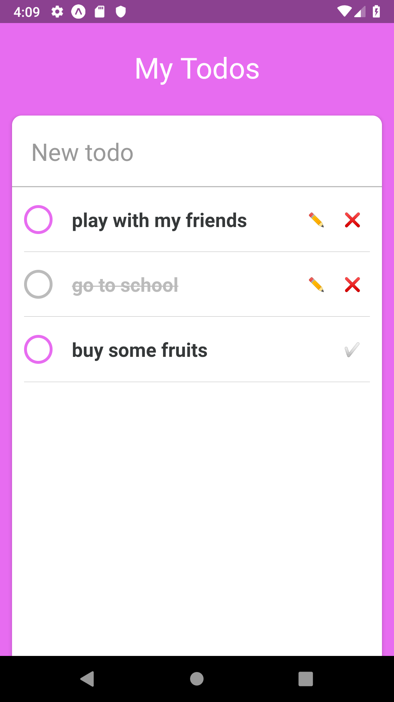

# React native todo app

- just for study
- follow nomad corder lectures.
- https://www.youtube.com/watch?v=PMGPZ1ywO3I&list=PL7jH19IHhOLOefIzCSQ03xlBekyi81FVv&index=12

## install expo-cli

- npm i -g expo-cli

## start project

- expo init [pj name]
 
## build android

- app.json에 패키지 정보추가
- "android":{
      "package": "com.cockroach54.todo"
    }
- expo build:android

## tip

- 안드로이드 에뮬레이터와 같은 네트워크 환경이 아니면 connection -> turnnel로 변경
- 빌드 후 코드 변경시엔 퍼블리시 해주기 (모바일에선 다시 앱 설치 불필요)
 - js 이외의 것이 바뀌면 apk재빌드 필요
 - 실제 앱에 업데이트 반영되는데 시간이 좀 필요한듯... 조금 느림

## todo app

  
  
  

